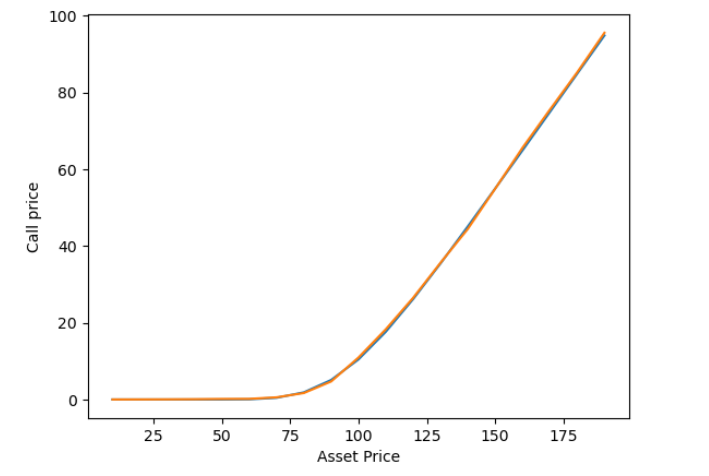
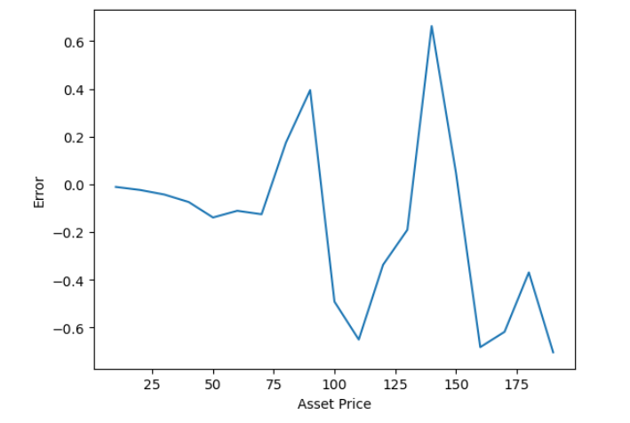

# Black-Scholes option pricing using DNN 

## NON-TECHNICAL EXPLANATION OF YOUR PROJECT
Financial derivatives are priced using complex functions with many parameters that sometimes take a long time to evaluate.  To value and analyse risk on large portfolios of these derivatives requires significant compute power.

Can a machine learning model be developed that accurately prices a derivative using less compute?

This project looks at a simple case to replicate the Black-Scholes option pricing formula using a neural-network to explore achievable accuracy.

## DATA
The dataset we used for this experiment was generated ourselves, using a python implementation of the Black-Scholes model.  We chose an arbitrary but appropriate set of parameter values to attempt to span the parameter space.

## MODEL 
We decided to use a neural-net implemented in pyTorch for this problem.  The Black-Scholes option pricing formula is fairly simple and produces a smooth transformation from input parameters to price space so we felt it shouldn't be too difficult to fit a model that gave ok results.  It was also a good opportunity to try out some hyperparameter tuning based on the work we did throughout the course.

## HYPERPARAMETER OPTIMSATION
We focused on model architecture to determine an optimal (or at least better) organisation of layer depth and width.  We started out with a single hidden layer model with 100 nodes, then iterated this down to 32 nodes.  We then added another hidden layer to make a final model of one input layer 5->32.  Two hidden layers 32->32. One output layer 32->1

## RESULTS
The main takeaway is that even a simple neural-net can be used to price derivatives.  Without too much investigation we were able to build a model that replicates the output of the Black-Scholes model quite accurately.  

